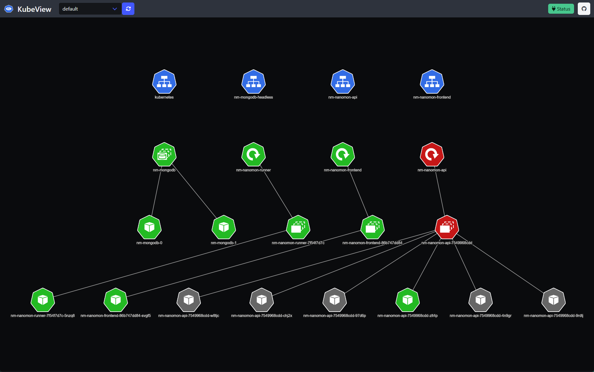

# KubeView 2

KubeView 2 is a Kubernetes cluster visualization tool that provides a graphical representation of your cluster's resources and their relationships. It helps you understand the structure and dependencies of your Kubernetes resources, making it easier to manage and troubleshoot your cluster. It is a complete ground-up rewrite of the original KubeView project, which I mainly wrote on a train to Norwich in 2019.

See the [original KubeView project](https://github.com/benc-uk/kubeview) for more information.

## Status: WIP

## Goals

The goal of this rewrite is to create a more maintainable codebase. Some choices that have been made to achieve this goal are:

- Removal of any sort of JS framework, no Vue.js, React etc. And no bundling required.
- Switch to [HTMX](https://htmx.org/), putting some of the logic in the backend.
- Use of [templ library](https://templ.guide/) for templating and server side rendering.
- Switch to [Bulma](https://bulma.io/) for CSS
- Clean up the JS for parsing resources and their relationships.

## Features

- Lists all namespaces in a Kubernetes cluster and user can select one
- Shows SOME common resources in a Kubernetes cluster namespace
- Shows SOME relationships between resources
