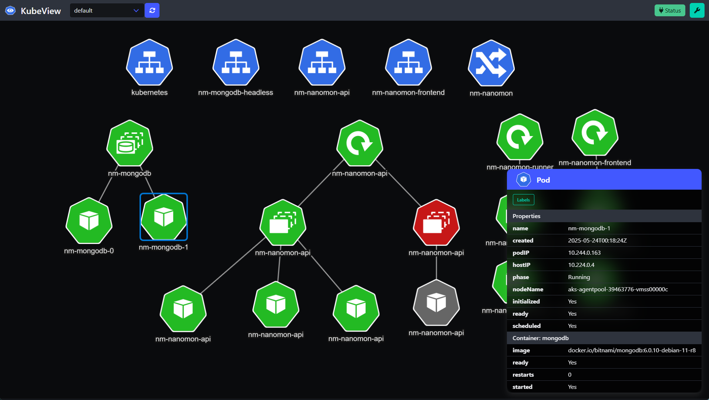

# KubeView 2

KubeView 2 is a Kubernetes cluster visualization tool that provides a graphical representation of your cluster's resources and their relationships. It helps you understand the structure and dependencies of your Kubernetes resources, making it easier to manage and troubleshoot your cluster. It is a complete ground-up rewrite of the original KubeView project, which I mainly wrote on a train to Norwich in 2019.

See the [original KubeView project](https://github.com/benc-uk/kubeview) for more information.

## Status

### Features / Status

- [x] List all namespaces in a Kubernetes cluster and user can select one
- [x] User settings
- [x] Streams updates from the server via SEE
- [x] Show most common resources in a Kubernetes cluster namespace
- [x] Side panel with resource details
- [ ] Linking logic WIP
- [ ] Dockerfile and Helm

## Goals

The goal of this rewrite is to create a more maintainable codebase. Some choices that have been made to achieve this goal are:

- Removal of any sort of JS framework, no Vue.js, React etc. And no bundling required.
- Switch to [HTMX](https://htmx.org/), putting some of the logic in the backend.
- Using SSE (Server-Sent Events) for real-time updates instead of polling.
- Use of [templ library](https://templ.guide/) for templating and server side rendering.
- Use of [Alpine.js](https://alpinejs.dev/) for client side behaviour.
- Switch to [Bulma](https://bulma.io/) for CSS
- Clean up the JS for parsing resources and their relationships.
