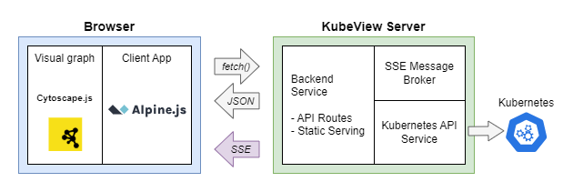

# KubeView 2

KubeView 2 is a Kubernetes cluster visualization tool that provides a graphical representation of your cluster's resources and their relationships. It helps you understand the structure and dependencies of your Kubernetes resources, making it easier to manage and troubleshoot your cluster. It is a complete ground-up rewrite of the [original KubeView project](https://github.com/benc-uk/kubeview). For the rest of this doc I will refer to this new v2 version as just KubeView.

[](https://github.com/benc-uk/kubeview2/actions/workflows/ci.yaml)


## Details


### Features

- Provides a secure read-only view of resources in a graph, with nodes representing resources and edges representing relationships
- Colour coding of resources based on their status and health
- Side panel allows you to view details of resources
- Filtering of resources by type to reduce clutter
- Real-time updates using Server-Sent Events (SSE)

## Architecture & Design

KubeView is built using Go for the backend, rendering HTML using templ. The frontend uses a combination of HTMX for dynamic content fetching and Alpine.js for client-side interactivity. The visualization is powered by Cytoscape.js, which provides the graph rendering and visualization capabilities

The backend uses the Go client for Kubernetes to interact with the cluster and retrieve resource information, including setting up watchers for real-time updates streamed using SSE. The templating engine is used to render the HTML pages, which are then served to the client.



## Security and Kubernetes Auth

The KubeView backend connects to the Kubernetes API via two methods, depending on where it is running:

- **Outside a Kubernetes cluster:** In this mode, it locates the local Kubernetes configuration file (usually located at `$HOME/.kube/config`) to authenticate and access the cluster. This is suitable for local development or when running KubeView on a machine that has access to the Kubernetes cluster.
- **Inside a Kubernetes cluster:** When running inside a cluster, KubeView uses a service account associated with the pod to authenticate and access the cluster. This service account should be assigned a role that grants it read-only access to the resources you want to visualize. This is the recommended way to run KubeView, and the Helm chart provides a service account, role & role-binding that can be used to set this up easily.

## Running Locally

Pre-reqs:

- Docker or other container runtime like Podman.
- A Kubernetes cluster to connect to (can be local or remote)
- A valid Kubernetes configuration file (usually located at `$HOME/.kube/config`), if you using kubectl, chances are you already have this set up.

Running it via Docker is the easiest way to get started. You can quickly run KubeView locally with the following command:

```bash
docker run --rm -it --volume "$HOME/.kube:/root/.kube" \
 -p 8000:8000 ghcr.io/benc-uk/kubeview2:latest
```

This mounts your local Kubernetes configuration directory `$HOME/.kube` into the container, allowing KubeView to access your cluster. The app will be accessible at `http://localhost:8000`. If your config file is located elsewhere, you need to adjust the volume mount accordingly.

## Deploying to Kubernetes

Use the [provided Helm chart](deploy/helm) and [GitHub published images](https://github.com/benc-uk?tab=packages&repo_name=kubeview2) to deploy KubeView to your Kubernetes cluster. The chart is designed to be simple and easy to use, with a range of configuration options.

## Developer Guide

If you wish to contribute to KubeView, or make changes, it is suggested to use the dev container provided in the repo. This will ensure you have all the dependencies installed and configured correctly.

### The .dev folder

The `.dev` directory is an new attempt to reduce the number of files in the root directory. It contains configuration files for various development tools, air, golangci-lint, eslint, prettier, and more. This is to keep the root directory clean and focused on the main application code. The use of a separate `tools.mod` file keeps Go tool dependencies separate from the main `go.mod` file, which is a good practice for managing development dependencies.

The makefile provides a number of commands to help you get started:

```text
help                 💬 This help message :)
lint                 🔍 Lint & format check only, use for CI
lint-fix             ✨ Lint & try to format & fix
run                  🏃 Run application, used for local development
build                🔨 Build application binary
generate             📑 Compile templ templates
clean                🧹 Clean up and reset
image                📦 Build container image from Dockerfile
push                 📤 Push container image to registry
helm-docs            📜 Update docs & readme for Helm chart
helm-package         🔠 Package Helm chart and update index
```

### Project Structure

The project is structured as follows:

```text
📂
 ├── deploy           # Dockerfile and Helm chart
 ├── docs
 ├── public           # Static files served by the web server
 │   ├── css          # Stylesheets
 │   ├── ext          # External libraries (e.g., Cytoscape.js, Alpine.js)
 │   ├── img          # Images and icons
 │   └── js           # All client side JavaScript, see main.js for entry point
 └── server
     ├── services     # Services for handling Kubernetes resources and SSE
     └── templates    # Templ templates for rendering HTML
```

## Why a v2 Rewrite?

The goal of this rewrite was to create a more maintainable codebase from the original KubeView. Some choices that have been made in this rewrite include:

- Removal of any sort of JS framework, no Vue.js, and no bundling or NPM required.
- Switch to [HTMX](https://htmx.org/) and [templ](https://templ.guide/), putting much of the logic in the backend.
- Using SSE (Server-Sent Events) for real-time updates instead of polling.
- Use of [Alpine.js](https://alpinejs.dev/) for managing client side behaviour.
- Switch to [Bulma](https://bulma.io/) for CSS and themes.
- Clean up & refactor messy parsing logic for resources and their relationships (but it's still pretty messy!).

In retrospect, the results are not as elegant or clean as were hoped, much of the logic has to reside client side due to the use of Cytoscape.js. In order to get the required user experience, numerous subtle interactions between the client and server creep in. These are difficult to fully encapsulate or abstract away. However, the code is arguably more maintainable than the original KubeView, and the addition of SSE allows for a more responsive experience without the need for constant polling.

## Appendix: API Role

The Kubernetes API permissions needed are `get`, `list`, `watch` for all of the following resources

- v1/pods
- v1/namespaces
- v1/services
- v1/configmaps
- v1/secrets
- v1/endpoints
- v1/persistentvolumesclaims
- apps/v1/deployments
- apps/v1/replicasets
- apps/v1/statefulsets
- apps/v1/daemonsets
- extensions/v1beta1/ingresses
- networking.k8s.io/v1/ingresses
- batch/v1/jobs
- batch/v1/cronjobs
